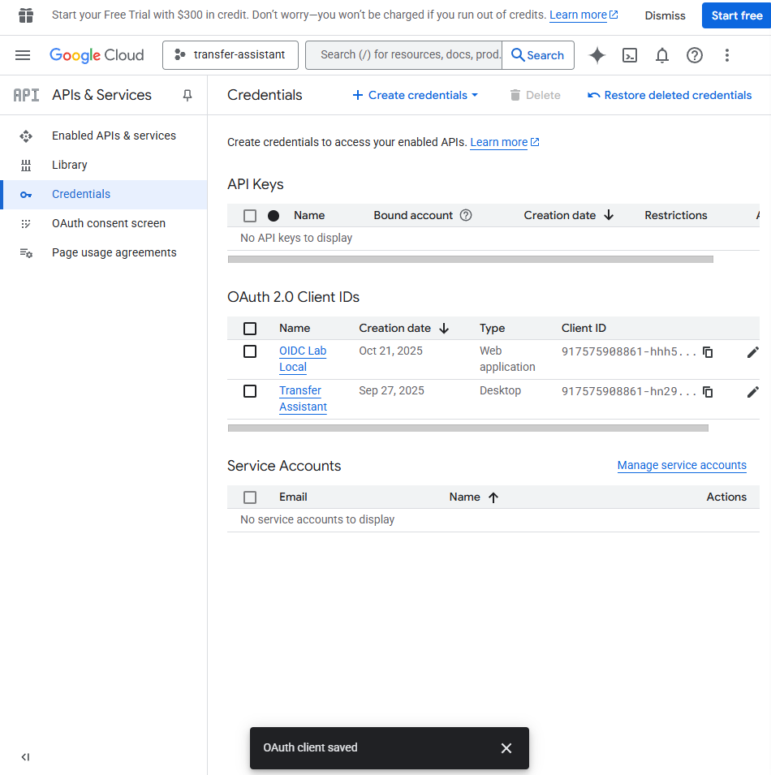
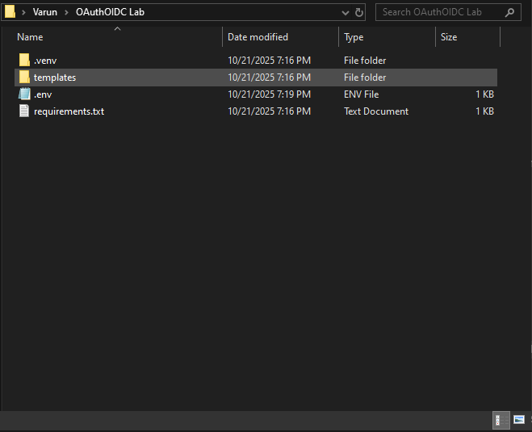
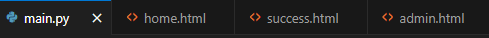
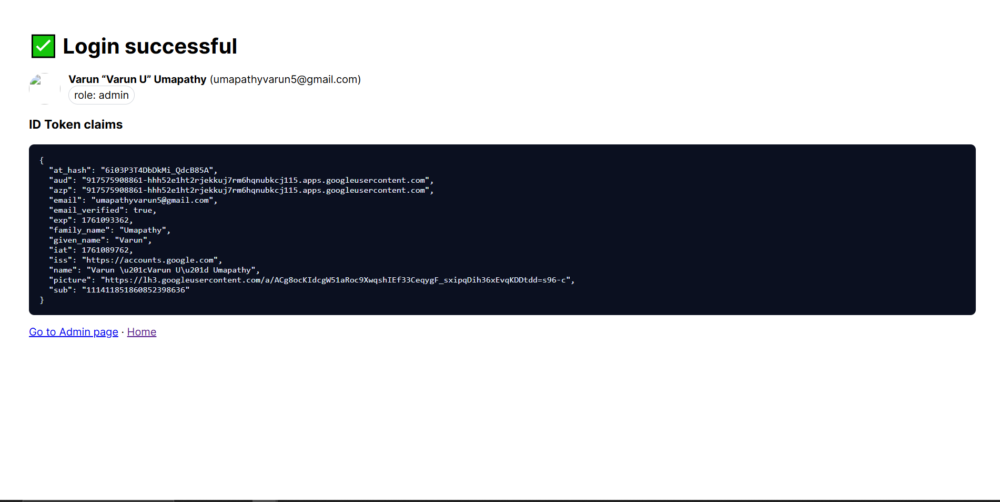
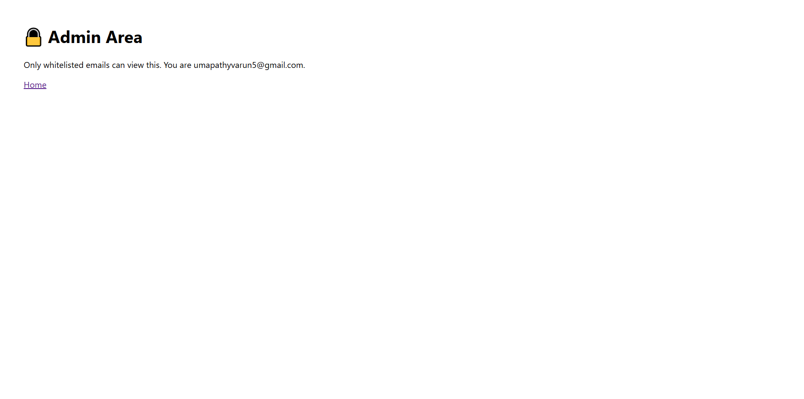
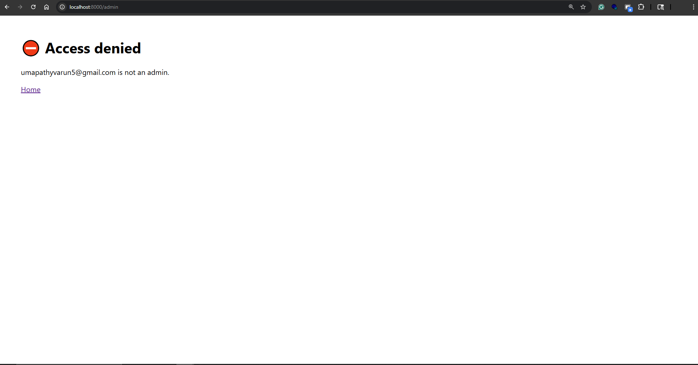
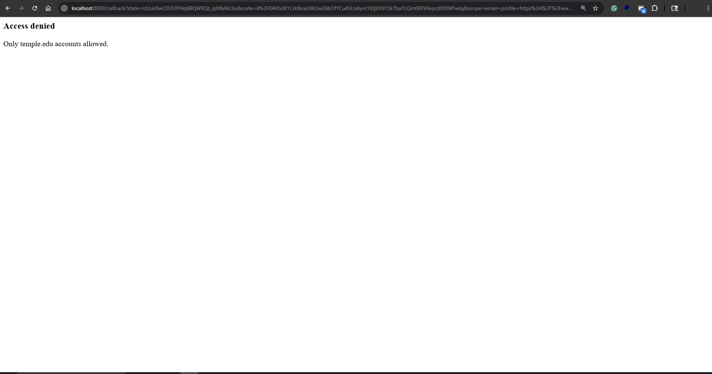

# 🧠 OIDC Lab — FastAPI + Google OIDC (PKCE)

## Step 1 — Google OAuth setup

Created a Web application OAuth client named **OIDC Lab Local** with redirect `http://localhost:8000/callback`. The client secret stays in a local `.env` (not in git).

## Step 2 — Project setup + .env

Created the `oidc-lab` folder, virtualenv, installed deps, and added a `.env` with placeholders.

## Step 3 — App code + successful login


Added FastAPI app + templates; OAuth 2.0 Authorization Code + PKCE works end-to-end. ID token verified and claims shown.

## Step 4 — Domain enforcement + RBAC



Verified admin allowlist and optional domain gate.


Environment (.env)
GOOGLE_CLIENT_ID=...apps.googleusercontent.com
GOOGLE_CLIENT_SECRET=...
BASE_URL=http://localhost:8000
SESSION_SECRET=<random string>
ADMIN_EMAILS=umapathyvarun5@gmail.com
ENFORCE_DOMAIN=
Keep .env out of git (see .gitignore). Rotate the secret if it ever leaks.

What I learned:
-OAuth 2.0 Authorization Code + PKCE
-Server-side ID token verification (google-auth, JWKS)
-Decoded JWT claims display
-RBAC via ADMIN_EMAILS
-Domain gate via ENFORCE_DOMAIN
-Troubleshooting (quick fixes)
    -redirect_uri_mismatch → redirect http://localhost:8000/callback in Google Console
    -“Token used too early” → Windows time sync → Date & time → Sync now
    -Env changes not taking effect → Ctrl+C to stop server, restart, re-login

## Run locally
```bash
pip install -r requirements.txt
uvicorn main:app --reload --port 8000
